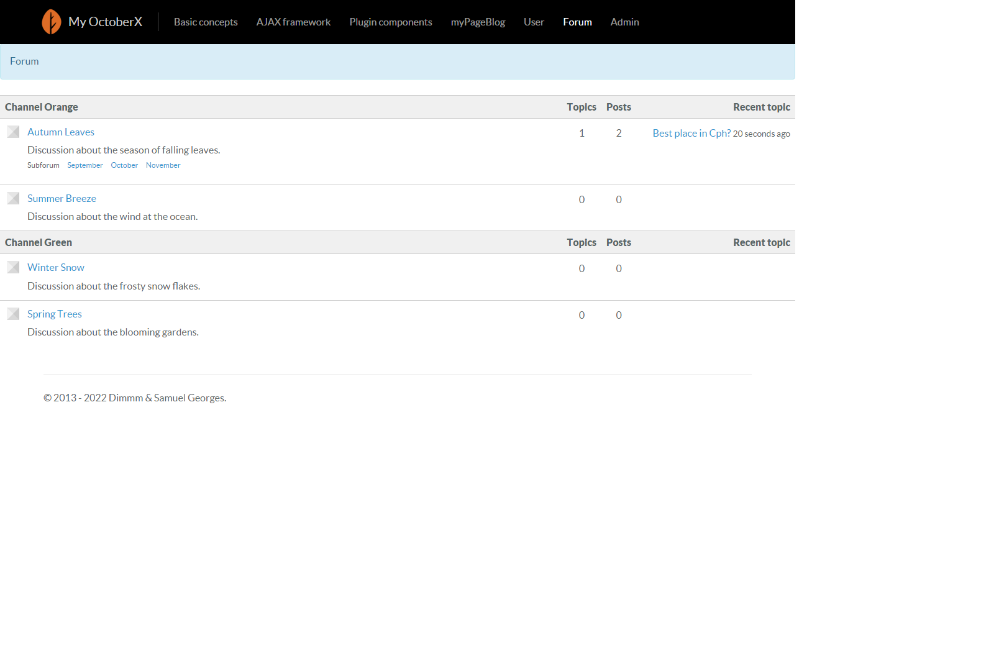
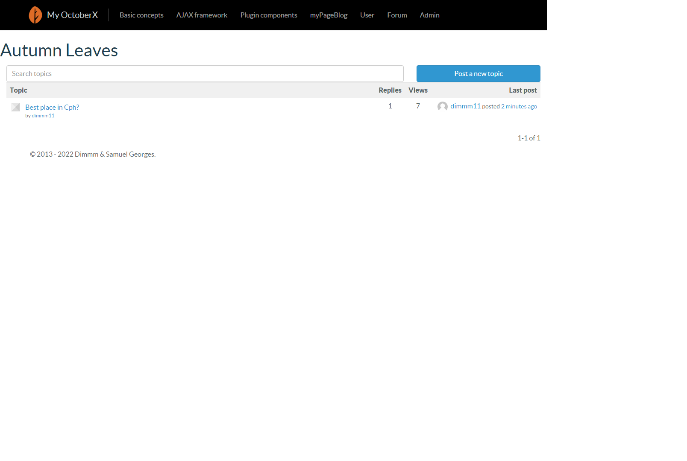
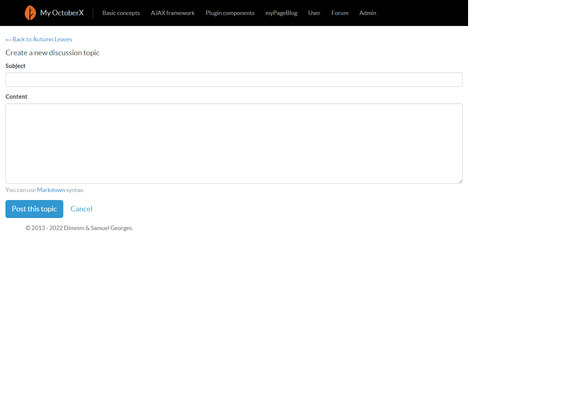
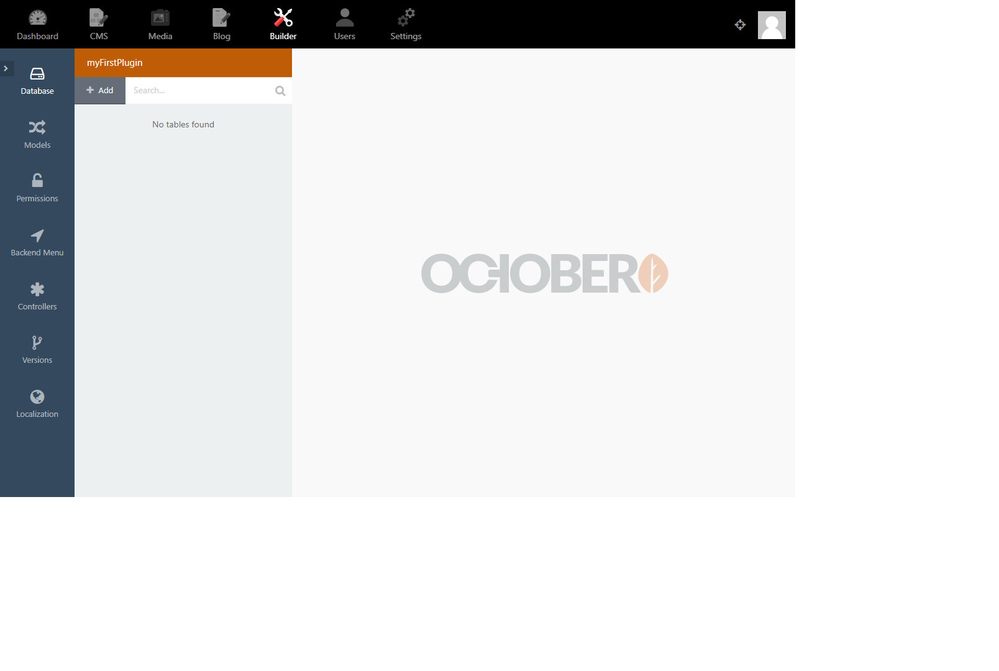
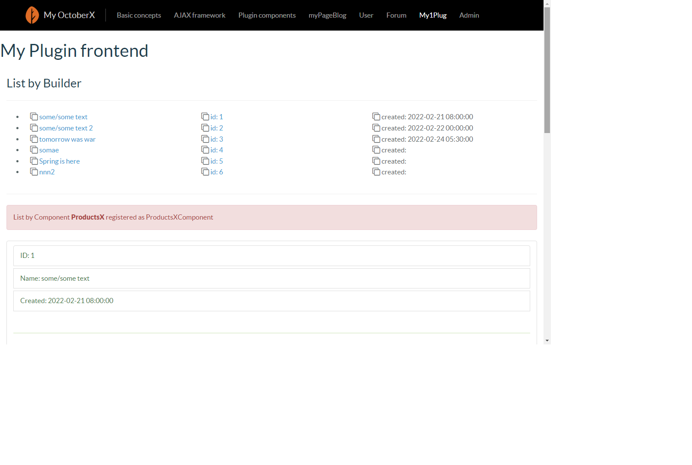

## October CMS

## Blog and User plugins

## Forum plugin

## Builder plugin

## My 1st plug-in on Builder plugin

# Installation Wizard for October CMS v1.0

The wizard installation will install the free version of October CMS (v1.0) for testing, trial and teaching purposes.

1. Prepare a directory on your server that is empty. It can be a sub-directory, domain root or a sub-domain.
1. [Download the installer archive file](https://github.com/octobercms/install/archive/master.zip).
1. Unpack the installer archive to the prepared directory.
1. Grant writing permissions on the installation directory and all its subdirectories and files.
1. Navigate to the install.php script in your web browser.
1. Follow the installation instructions.

> **Note**: This version is no longer actively maintained and will only receive security updates. See [instructions below for installing v2.0 of October CMS](#installing-october-cms-v20).

### Minimum System Requirements

October CMS v1.0 has a few system requirements:

* PHP version 7.2 or higher
* PDO PHP Extension (and relevant driver for the database you want to connect to)
* cURL PHP Extension
* OpenSSL PHP Extension
* Mbstring PHP Extension
* ZipArchive PHP Extension
* GD PHP Extension
* SimpleXML PHP Extension

### OS Dependencies

Some OS distributions may require you to manually install some of the required PHP extensions.

When using Ubuntu, the following command can be run to install all required extensions:

    sudo apt-get update &&
    sudo apt-get install php php-ctype php-curl php-xml php-fileinfo php-gd php-json php-mbstring php-mysql php-sqlite3 php-zip

## Installing October CMS v2.0

The latest version of October CMS is v2.0, a professionally managed version of October CMS. A small fee is required to use this version. It uses composer for its dependency management and can be installed with this command.

    composer create-project october/october myoctober

For further information, visit the [documentation for installation instructions](https://octobercms.com/docs/setup/installation).
